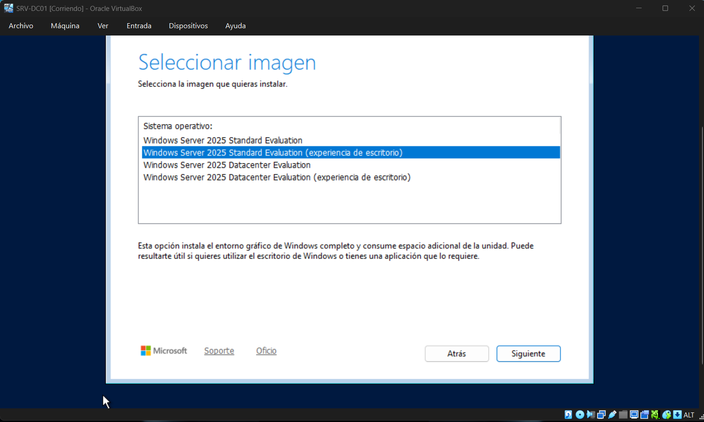
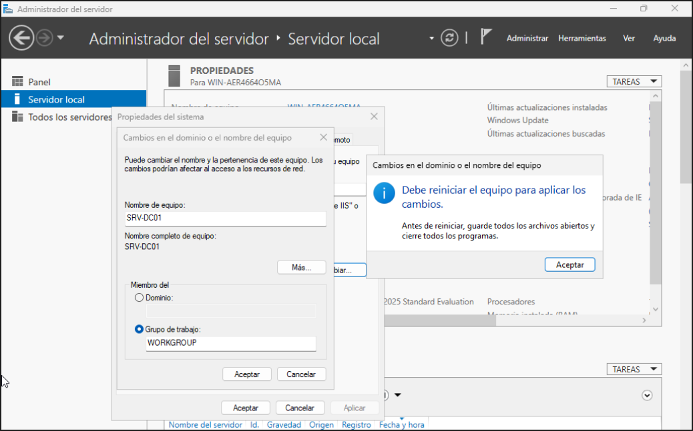

# Instalación y Configuración Básica del Servidor

## 1. Despliegue de la Plataforma Base

Para iniciar el entorno, se configuró una máquina virtual en VirtualBox asignándole almacenamiento dinámico y un adaptador de red en modo **Red interna** con el nombre `redlab`. Esta decisión técnica es indispensable para aislar el tráfico de pruebas del laboratorio y evitar conflictos con redes externas. Se instaló **Windows Server 2025 Standard (Experiencia de escritorio)** en español. La interfaz gráfica (GUI) es requerida para agilizar las tareas iniciales de administración del servidor local.

## 2. Identidad del Servidor

Desde el Administrador del Servidor, se modificó el nombre genérico del sistema por el identificador estándar `SRV-DC01`. Esta nomenclatura permite una localización inequívoca dentro de la topología lógica del dominio. Posterior al cambio, se procedió con el reinicio obligatorio del sistema para asentar la nueva identidad en el registro.

## 3. Direccionamiento IP Estático y Seguridad

Se asignó una configuración de red estática en el adaptador Ethernet principal. Una dirección fija es un requisito mandatorio para un controlador de dominio, garantizando que los servicios de DNS y Active Directory se encuentren siempre en una ubicación predecible dentro del segmento de red.

- **Dirección IPv4:** `192.168.10.10`
- **Máscara de Subred:** `255.255.255.0`
- **Puerta de Enlace:** Vacía (Entorno aislado sin enrutamiento externo)
- **Servidor DNS Preferido:** `127.0.0.1` (Dirección de loopback, dado que el servidor resolverá sus propios nombres de dominio)

A nivel de seguridad, se verificó que el **Windows Defender Firewall** permaneciera completamente activo en todos sus perfiles. Mantener el firewall activado resguarda el sistema base, asegurando que solo los puertos autorizados por los roles explícitamente instalados (como el puerto 53 para DNS o el 389 para LDAP) queden expuestos a la red.
