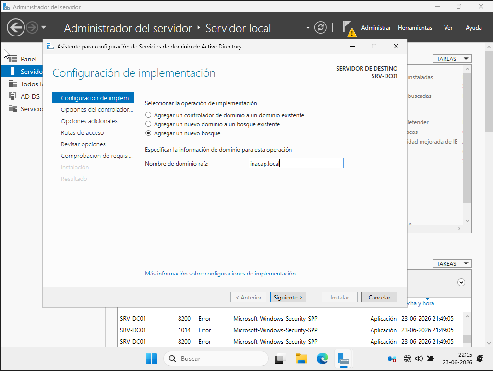
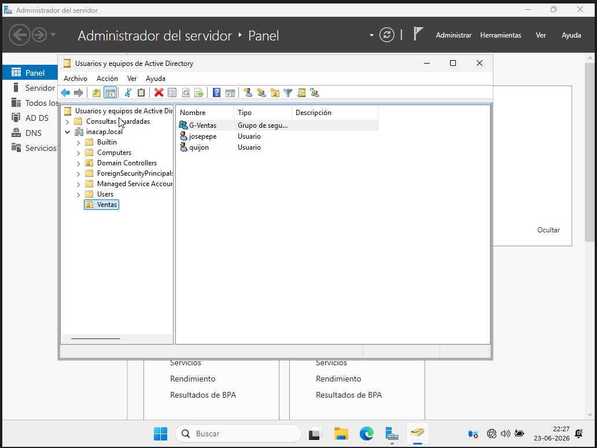
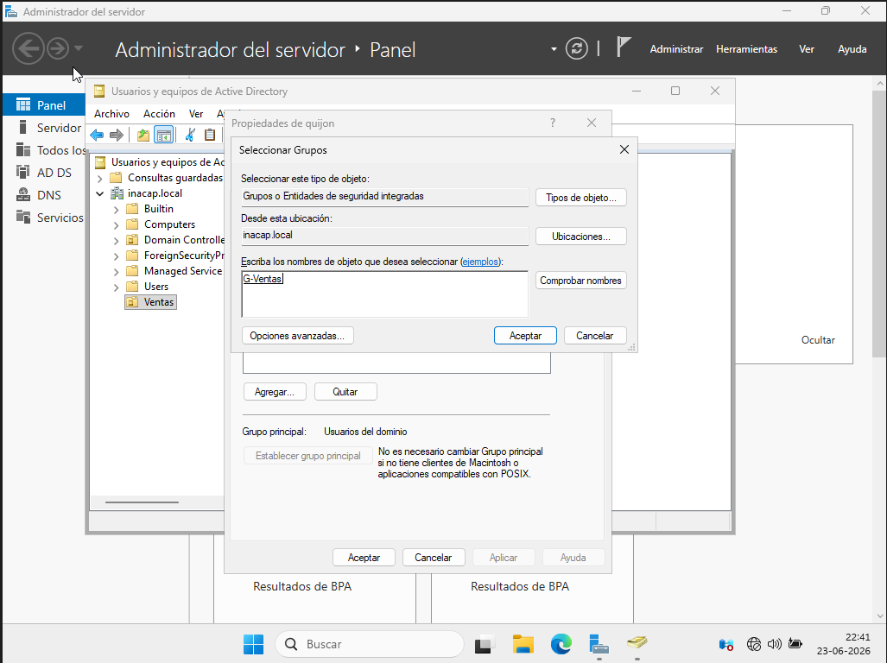

# Active Directory y Gestión de Objetos del Dominio

## 1. Promoción a Controlador de Dominio (DC)

Se procedió con la instalación del rol de **Servicios de dominio de Active Directory (AD DS)** a través del asistente de roles. Tras completar la instalación de las características, se seleccionó la bandera de notificación para promover el servidor, optando por la creación de un nuevo bosque con el dominio raíz denominado `inacap.local`. Esta acción inicializa la base de datos distribuida de Active Directory y levanta de manera automática el servicio DNS integrado, fundamental para la posterior localización de directivas y servicios en la red.

## 2. Organización y Gestión de Objetos

Para cumplir con las directrices de una administración estructurada y ordenada por departamentos, se ingresó a la consola de _Usuarios y equipos de Active Directory_.

- **Unidad Organizativa (OU):** Se creó una OU principal llamada `Ventas`. El uso de OUs permite segmentar el dominio lógico, facilitando la delegación de controles y la aplicación selectiva de políticas del grupo (GPOs) sin afectar a todo el árbol organizacional.
- **Usuarios:** Dentro de la OU `Ventas`, se crearon dos cuentas de usuario de manera corporativa. Una de ellas corresponde al código de identificación unívoco del estudiante: `quijon`.
- **Grupos de Seguridad:** Se dio de alta un grupo global de seguridad llamado `G-Ventas`. Los grupos de seguridad optimizan la asignación de permisos sobre recursos compartidos, evitando la tediosa gestión manual usuario por usuario.

## 3. Asignación de Membresía

Se accedió a las propiedades del usuario creado con el código personal `quijon` y se utilizó la pestaña _Miembro de_ para incorporarlo formalmente al grupo de seguridad `G-Ventas`. Esto asegura la correcta herencia de políticas y configuraciones colectivas de seguridad.

