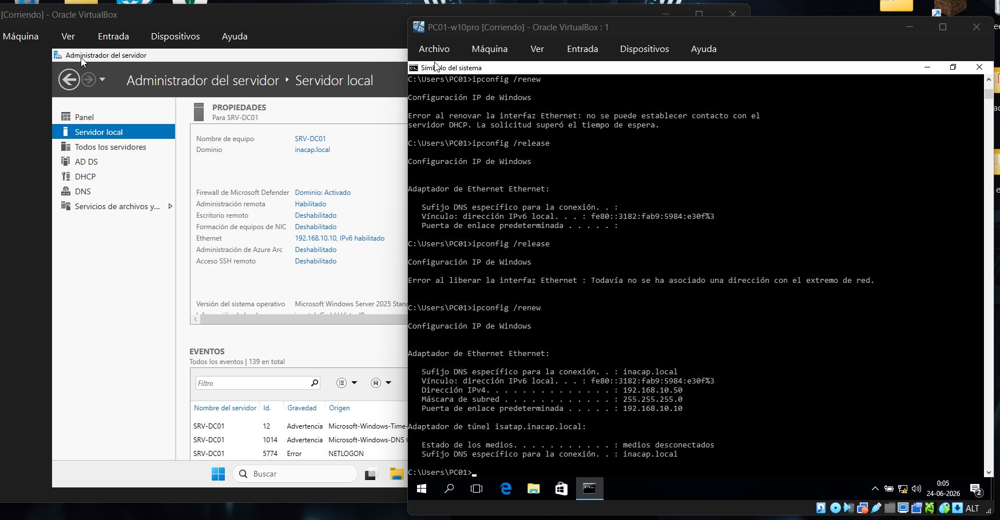
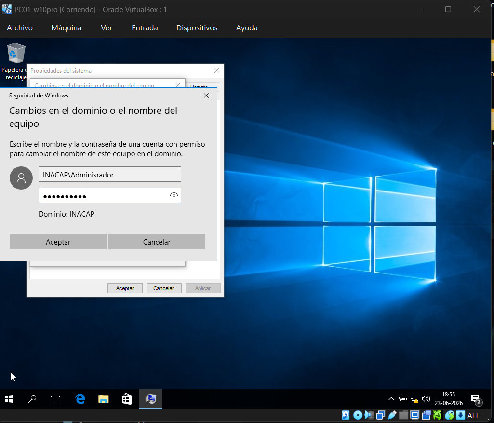
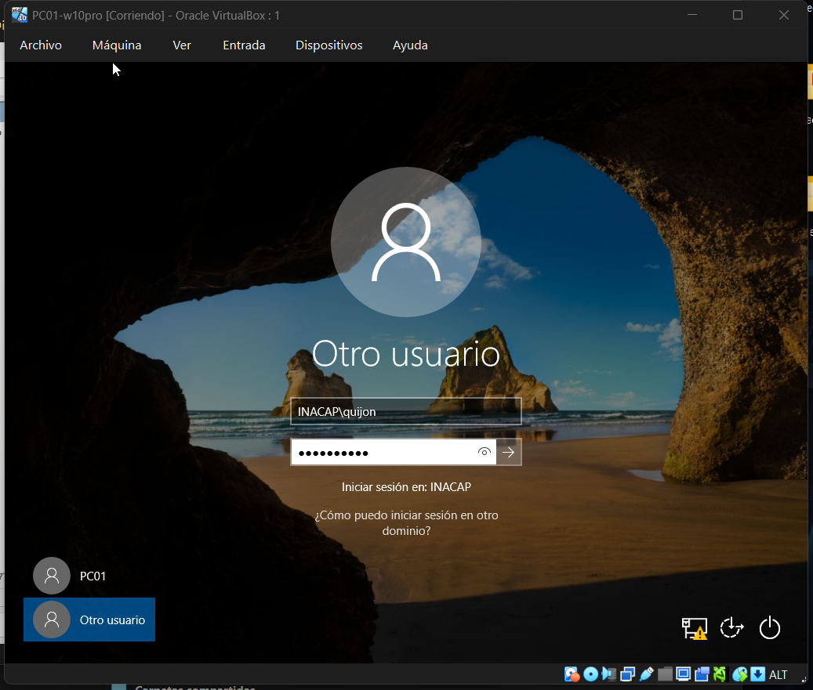

# Incorporación de la Estación Cliente al Dominio

## 1. Conectividad y Preparación del Entorno

La máquina cliente, configurada con **Windows 10 Pro**, se enlazó a la misma red interna virtualizada `redlab`. Contar con una edición Pro o superior es un requisito técnico mandatorio, ya que las versiones Home de Windows carecen por diseño de la capacidad de interactuar con infraestructuras de dominio empresariales. Tras inicializar el adaptador de red, se comprobó la correcta recepción de direccionamiento IP mediante el servidor DHCP de la red.

## 2. Proceso de Unión al Dominio `inacap.local`

Utilizando la consola de propiedades avanzadas del sistema (`sysdm.cpl`), se cambió la membresía del equipo desde un grupo de trabajo local hacia el dominio corporativo `inacap.local`. Para autorizar la creación de la cuenta de equipo en el directorio, el sistema solicitó credenciales de red autorizadas, introduciendo el usuario administrador del dominio: `INACAP\Administrator` junto a sus respectivas credenciales de acceso.

## 3. Validación de Inicio de Sesión Centralizado

Luego del reinicio requerido por Windows para aplicar los cambios de red, se seleccionó la opción _Otro usuario_ en la interfaz de bienvenida del cliente. Se introdujeron las credenciales del usuario creado en Active Directory utilizando la sintaxis de dominio: `INACAP\quijon`. El inicio de sesión exitoso confirma el correcto funcionamiento de los canales de comunicación, validando la autenticación centralizada y la correcta resolución DNS del controlador de dominio.

