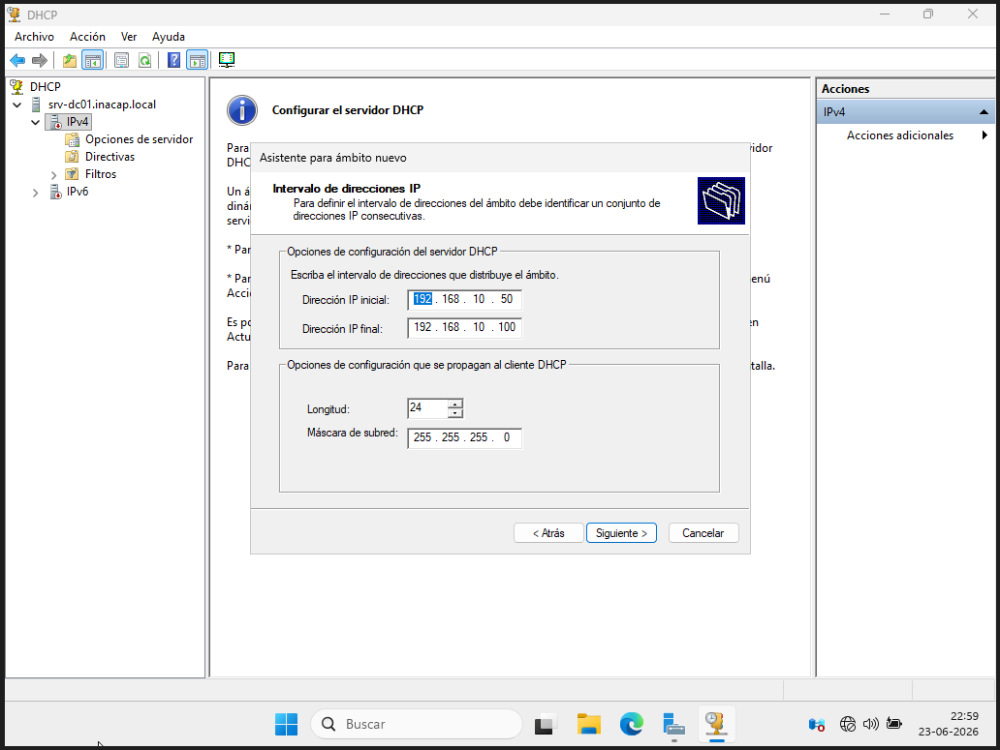
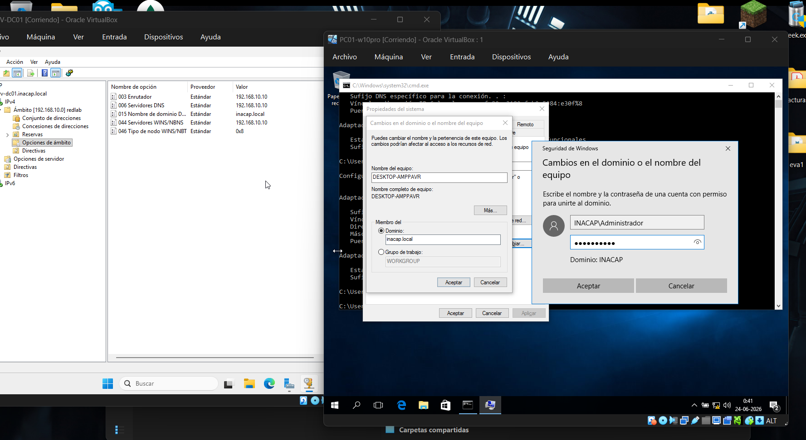

# Servicios de Red (DNS y DHCP)

## 1. Implementación del Servicio DHCP

Se instaló el rol de **Servidor DHCP** en `SRV-DC01` y se completó su correspondiente autorización técnica ante el Active Directory para garantizar que solo un servidor legítimo pueda distribuir configuraciones IP en la red de la organización. Dentro de la consola de administración DHCP, se creó un Ámbito IPv4 Nuevo estructurado bajo los siguientes parámetros operacionales:

- **Dirección IP Inicial:** `192.168.10.50`
- **Dirección IP Final:** `192.168.10.100`
- **Máscara de Subred:** `255.255.255.0` (Longitud de 24 bits)

Este rango dinámico deja las primeras 49 direcciones IP del segmento libres para asignaciones estáticas en servidores, impresoras de red o gateways de la infraestructura.

## 2. Opciones de Ámbito e Integración DNS

Para lograr una correcta integración de red, es crítico configurar las opciones avanzadas del ámbito DHCP que se propagan de manera automática hacia las estaciones de trabajo clientes:

- **Opción 003 (Enrutador / Puerta de Enlace):** Configurada con la IP proyectada del gateway de laboratorio (`192.168.10.10`).
- **Opción 006 (Servidores DNS):** Configurada apuntando estrictamente a la IP real de nuestro servidor DNS local (`192.168.10.10`).
- **Opción 015 (Nombre de Dominio):** Configurada con la cadena de texto exacta `inacap.local`.

Estas opciones aseguran que cualquier estación cliente que levante su interfaz en la red local obtenga la información necesaria para localizar de manera nativa los controladores de dominio de Active Directory sin necesidad de intervención manual.

