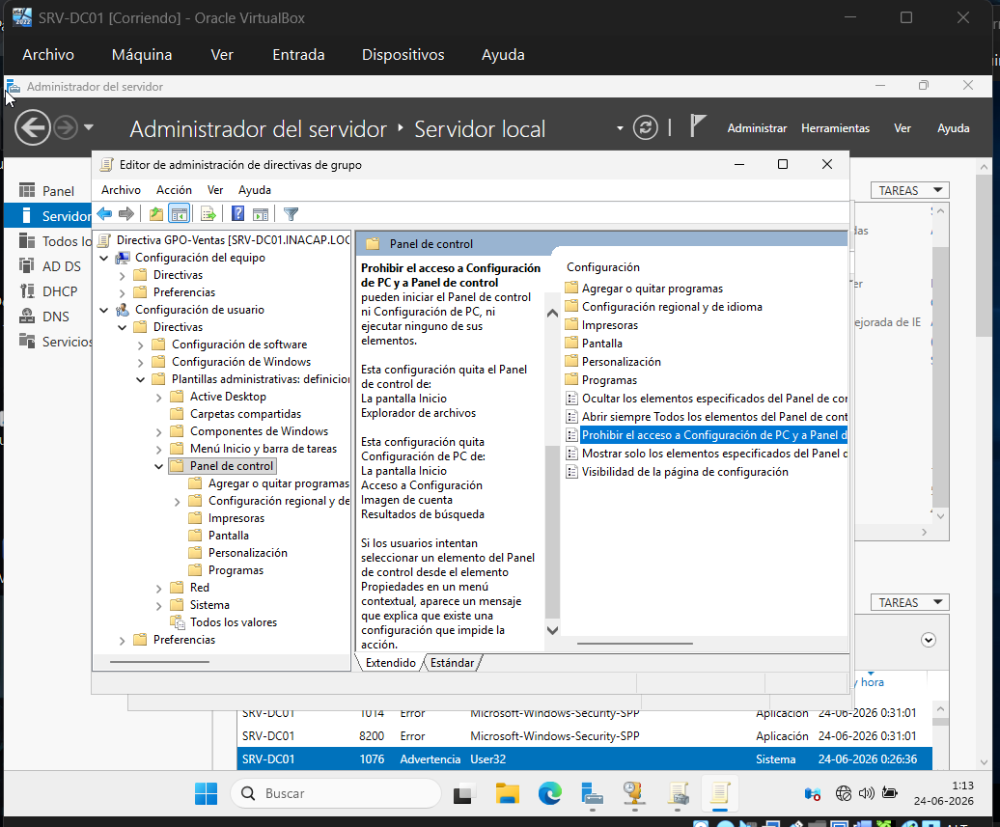
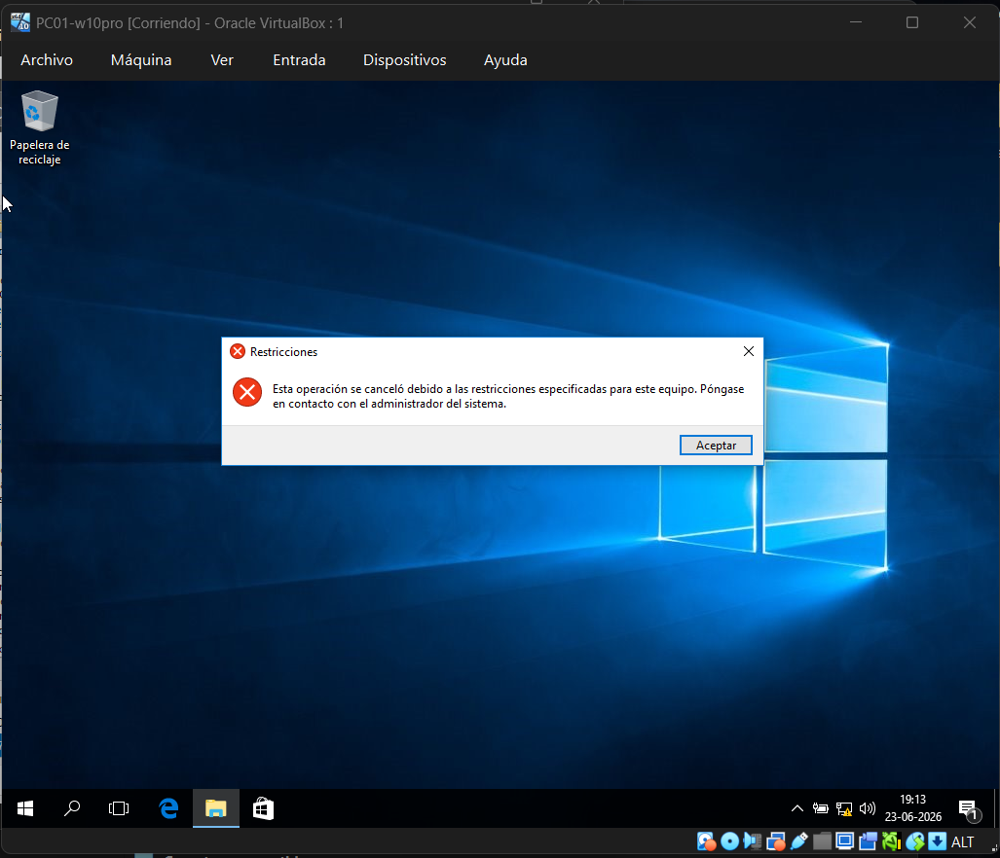
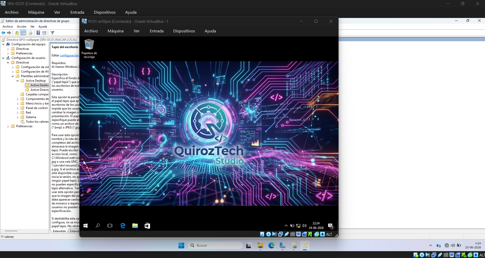

# Políticas de Grupo (GPO) y Desafío de Cierre

## 1. Configuración de Directiva de Seguridad Departamental

Para aplicar restricciones operacionales sobre los puestos de trabajo, se ingresó a la consola de _Administración de directivas de grupo_. Se hizo clic derecho sobre la Unidad Organizativa `Ventas` y se seleccionó la opción de crear y vincular un GPO en este dominio, denominándolo `GPO-Ventas`.

Se editó el objeto navegando por la ruta de directivas de usuario: _Configuración de usuario -> Directivas -> Plantillas administrativas -> Panel de control_. En este nodo se habilitó la directiva **Prohibir el acceso al Panel de control y a la configuración de PC**. El caso de uso de esta política busca limitar la superficie de desconfiguración de los equipos de producción por parte de usuarios finales no autorizados.

## 2. Aplicación y Validación de Restricciones en el Cliente

En la estación de trabajo `PC01`, bajo la sesión activa del usuario `quijon`, se abrió una consola de comandos para ejecutar la actualización inmediata de las políticas de seguridad mediante el comando `gpupdate /force`. Tras cerrar e iniciar sesión nuevamente para forzar la lectura del entorno de usuario, se intentó ingresar al Panel de Control de Windows. El sistema operativo desplegó de forma instantánea el cuadro de alerta de restricciones, validando el éxito de la directiva centralizada.

## 3. Desafío de Cierre: Papel Tapiz Corporativo Centralizado

Para resolver el desafío institucional de fijar un fondo de pantalla unificado para la empresa, se diseñó un flujo de despliegue centralizado basado en red.

1. **Ruta de Red Compartida (UNC):** La imagen de marca se almacenó en el disco local del servidor dentro del directorio `C:\wallpaper`. Esta carpeta se configuró con propiedades de _Uso compartido avanzado_ otorgando permisos de lectura para el grupo "Todos", mapeándose bajo la ruta UNC de red: `\\SRV-DC01\wallpaper\wallpaperQuirozTechStudio.jpg`.
2. **Configuración de GPO:** Se editó un nuevo objeto de directiva (`GPO-Wallpaper`) vinculado a la OU `Ventas`. Navegando por _Configuración de usuario -> Plantillas administrativas -> Escritorio -> Escritorio_, se activó la directiva **Tapiz del escritorio**, ingresando la ruta UNC compartida del servidor y definiendo el estilo en modo "Rellenar".
3. **Resultado Exitoso:** Tras refrescar las directivas, el cliente Windows 10 Pro desplegó de manera automática el fondo corporativo de **QuirozTech Studio**, deshabilitando la capacidad de modificación local por parte del operador del equipo.

